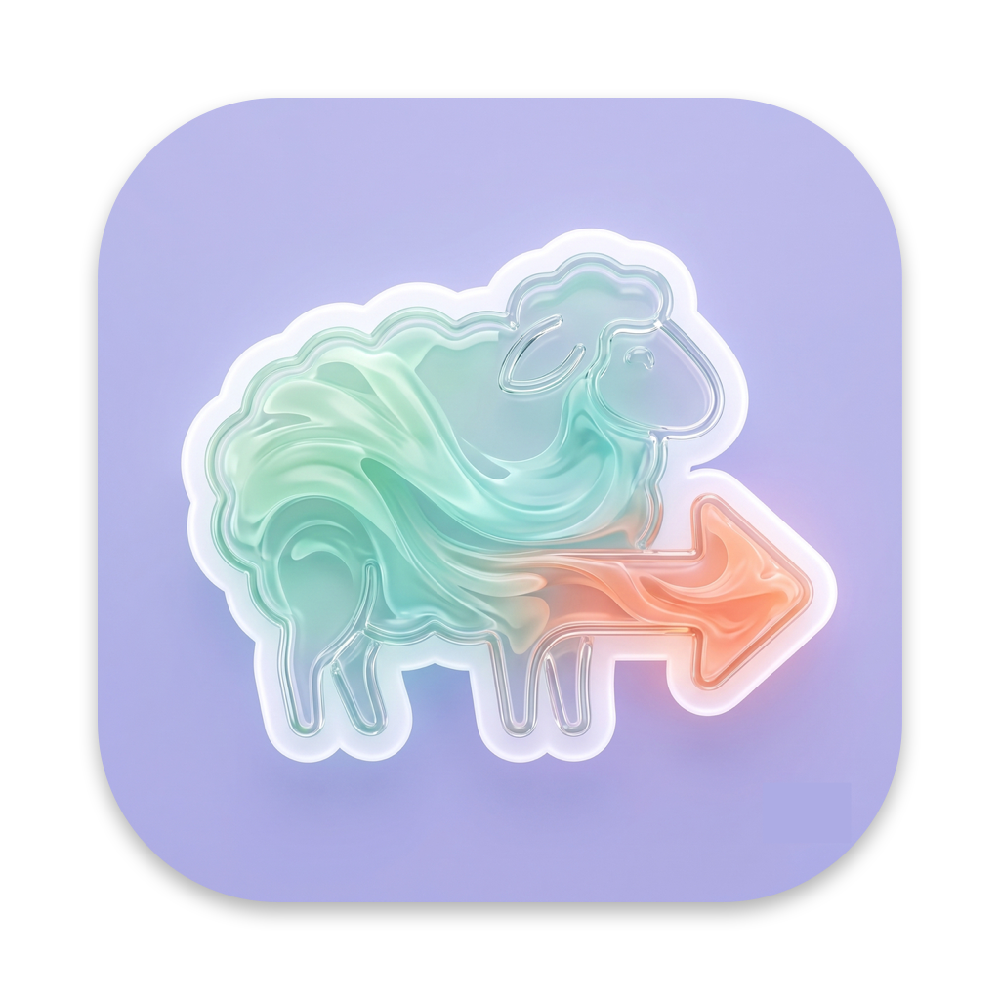

<p align="center">
  
</p>

<h1 align="center">Flock</h1>

<p align="center"><strong>A whole flock of terminals in one window.</strong></p>

Flock is a small macOS terminal app for people who like to keep several shells in view at once. Instead of tabs you flick between, Flock lines your terminals up **side by side** — one pen per task — so you can watch the whole flock graze at the same time.

## Features

- 🐑 **Pens, not tabs** — every terminal is a column with its own title. See them all at once, no switching.
- 🌾 **Two layouts** — *Compact* (resizable columns with horizontal scroll) or *Fixed* (a set grid, up to 3 × 5).
- ✂️ **Rename anything** — double-click a title, or right-click a header to rename, rearrange or close.
- 🎨 **Themes** — Meadow (the default), Dark, Light, Grass, High Contrast, or roll your own custom palette. Every hover and press state follows the theme.
- ⚡ **GPU-rendered text** — glyphs are painted by the graphics card, so heavy output and fast scrolling stay smooth.
- 🖥️ **A real shell** — each pen runs your actual login shell with full truecolor, so TUI apps render properly.
- 📊 **Optional activity bar** — per-terminal CPU and memory, tucked under each pen.
- 🗂️ **Open Folder** — start a terminal already sitting in the directory you care about.

## Install

**[⬇ Download the latest release](https://github.com/bethandutton/flock/releases/latest)** — grab the `.dmg`, open it and drag Flock into your Applications folder. Built for Apple Silicon Macs.

> **First launch:** Flock isn't code-signed yet, so macOS will warn you the first time. Right-click the app → **Open** → **Open**, and it'll behave normally from then on.

## Keyboard shortcuts

| Shortcut | Action |
|----------|--------|
| ⌘T | New terminal |
| ⌘W | Close the focused terminal |
| ⌘+ / ⌘− | Bigger / smaller text (per pen) |
| ⌘0 | Reset text size |
| ⌘, | Preferences |

## Running from source

You'll need Node.js and the Xcode Command Line Tools (one dependency compiles natively).

```bash
git clone https://github.com/bethandutton/flock.git
cd flock
npm install
npm start
```

## The vocabulary

The codebase speaks fluent sheep:

| Term | Meaning |
|------|---------|
| **Flock** | The app (and the whole herd of terminals) |
| **Pen** | One terminal — header, shell and all |
| **Field** | The area where the pens live |

Pull requests that respect the pasture are very welcome.

## Contributing

Flock is deliberately small: vanilla JavaScript, no framework, no build step. The layout is simple — `main.js` runs the shells, `renderer.js` draws the pens, `styles.css` holds every theme variable. Wander in, keep it sheep-themed, and pull requests are very welcome.

## Licence

[MIT](LICENSE) — free as in free-range.
